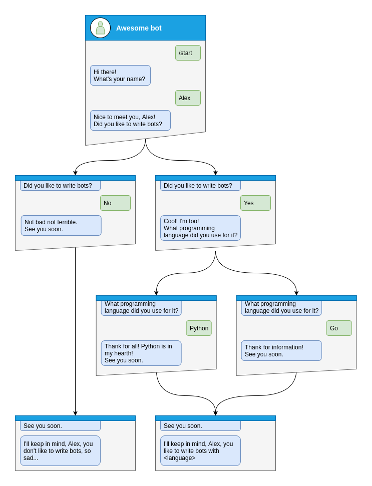

.. _Finite State Machine:

====================
Finite State Machine
====================

    A finite-state machine (FSM) or finite-state automaton (FSA, plural: automata), finite automaton,
    or simply a state machine, is a mathematical model of computation.

    It is an abstract machine that can be in exactly one of a finite number of states at any given time.
    The FSM can change from one state to another in response to some inputs;
    the change from one state to another is called a transition.

    An FSM is defined by a list of its states, its initial state,
    and the inputs that trigger each transition.

    .. raw:: html

        

    Source: `WikiPedia <wiki>`_

Usage example
=============

Not all functionality of the bot can be implemented as single handler,
for example you will need to collect some data from user in separated steps you will need to use FSM.

Let's see how to do that step-by-step

Step by step
------------

Before handle any states you will need to specify what kind of states you want to handle

.. literalinclude:: ../../../examples/finite_state_machine.py
    :pyobject: Form

And then write handler for each state separately from the start of dialog

Here is dialog can be started only via command :code:`/start`, so lets handle it and make transition user to state :code:`Form.name`

.. literalinclude:: ../../../examples/finite_state_machine.py
    :pyobject: command_start

After that you will need to save some data to the storage and make transition to next step.

.. literalinclude:: ../../../examples/finite_state_machine.py
    :pyobject: process_name

At the next steps user can make different answers, it can be `yes`, `no` or any other

Handle :code:`yes` and soon we need to handle :code:`Form.language` state

.. literalinclude:: ../../../examples/finite_state_machine.py
    :pyobject: process_like_write_bots

Handle :code:`no`

.. literalinclude:: ../../../examples/finite_state_machine.py
    :pyobject: process_dont_like_write_bots

And handle any other answers

.. literalinclude:: ../../../examples/finite_state_machine.py
    :pyobject: process_unknown_write_bots

All possible cases of `like_bots` step was covered, let's implement finally step

.. literalinclude:: ../../../examples/finite_state_machine.py
    :pyobject: process_language

.. literalinclude:: ../../../examples/finite_state_machine.py
    :pyobject: show_summary

And now you have covered all steps from the image, but you can make possibility to cancel conversation, lets do that via command or text

.. literalinclude:: ../../../examples/finite_state_machine.py
    :pyobject: cancel_handler

Complete example
----------------
.. literalinclude:: ../../../examples/finite_state_machine.py
    :language: python
    :linenos:

Changing state for another user
-------------------------------

In some cases, you might need to change the state for a user other than the one who triggered the current handler.
For example, you might want to change the state of a user based on an admin's command.

To do this, you can use the ``get_context`` method of the FSM middleware through the dispatcher:

.. code-block:: python

    @example_router.message(Command("example"))
    async def command_example(message: Message, dispatcher: Dispatcher, bot: Bot):
        user_id = ...  # Get the user ID in the way that you need
        state = await dispatcher.fsm.get_context(
            bot=bot,
            chat_id=user_id,
            user_id=user_id,
        )

        # Now you can use the state context to change the state for the specified user
        await state.set_state(YourState.some_state)

        # Or store data in the state
        await state.update_data(some_key="some_value")

        # Or clear the state
        await state.clear()

This allows you to manage the state of any user in your bot, not just the one who triggered the current handler.

Read more
=========

.. toctree::

    storages
    strategy
    scene

.. _wiki: https://en.wikipedia.org/wiki/Finite-state_machine
