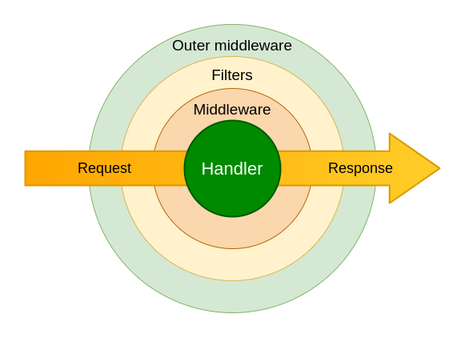

# Middlewares

**aiogram** provides powerful mechanism for customizing event handlers via middlewares.

Middlewares in bot framework seems like Middlewares mechanism in web-frameworks
(like [aiohttp](https://docs.aiohttp.org/en/stable/web_advanced.html#aiohttp-web-middlewares),
[fastapi](https://fastapi.tiangolo.com/tutorial/middleware/),
[Django](https://docs.djangoproject.com/en/3.0/topics/http/middleware/) or etc.)
with small difference - here is implemented two layers of middlewares (before and after filters).

!!! info
    Middleware is function that triggered on every event received from
    Telegram Bot API in many points on processing pipeline.

## Base theory

As many books and other literature in internet says:
> Middleware is reusable software that leverages patterns and frameworks to bridge
> the gap between the functional requirements of applications and the underlying operating systems,
> network protocol stacks, and databases.

Middleware can modify, extend or reject processing event in many places of pipeline.

## Basics

Middleware instance can be applied for every type of Telegram Event (Update, Message, etc.) in two places

1. Outer scope - before processing filters (`#!python <router>.<event>.outer_middleware(...)`)
2. Inner scope - after processing filters but before handler (`#!python <router>.<event>.middleware(...)`)

[](../assets/images/basics_middleware.png)

_(Click on image to zoom it)_

!!! warning

    Middleware should be subclass of `BaseMiddleware` (`#!python3 from aiogram import BaseMiddleware`) or any async callable

## Arguments specification
| Argument | Type | Description |
| - | - | - |
| `handler` | `#!python Callable[[T, Dict[str, Any]], Awaitable[Any]]` | Wrapped handler in middlewares chain |
| `event` | `#!python T` | Incoming event (Subclass of `TelegramObject`) |
| `data` | `#!python Dict[str, Any]` | Contextual data. Will be mapped to handler arguments |

## Examples

!!! danger

    Middleware should always call `#!python await handler(event, data)` to propagate event for next middleware/handler

### Class-based
```python3
from aiogram import BaseMiddleware
from aiogram.api.types import Message


class CounterMiddleware(BaseMiddleware[Message]):
    def __init__(self) -> None:
        self.counter = 0

    async def __call__(
        self, 
        handler: Callable[[Message, Dict[str, Any]], Awaitable[Any]],
        event: Message,
        data: Dict[str, Any]
    ) -> Any:
        self.counter += 1
        data['counter'] = self.counter
        return await handler(event, data)
```
and then
```python3
router = Router()
router.message.middleware(CounterMiddleware())
```

### Function-based
```python3
@dispatcher.update.outer_middleware()
async def database_transaction_middleware(
    handler: Callable[[Update, Dict[str, Any]], Awaitable[Any]],
    event: Update,
    data: Dict[str, Any]
) -> Any:
    async with database.transaction():
        return await handler(event, data)
```

## Facts

1. Middlewares from outer scope will be called on every incoming event
1. Middlewares from inner scope will be called only when filters pass
1. Inner middlewares is always calls for `Update` event type in due to all incoming updates going to specific event type handler through built in update handler

