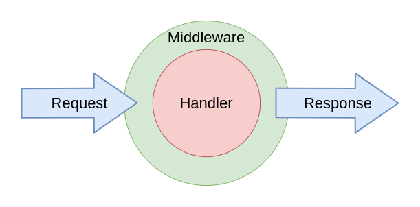
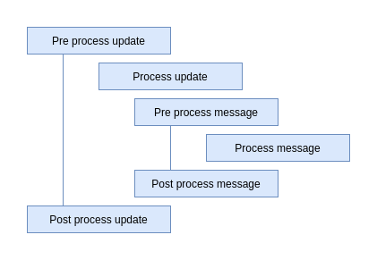
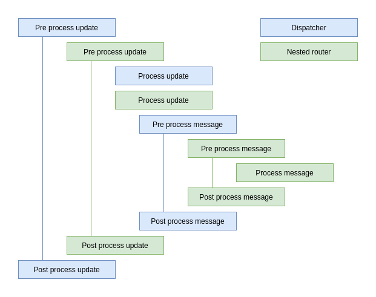

# Overview

**aiogram**'s provides powerful mechanism for customizing event handlers via middlewares.

Middlewares in bot framework seems like Middlewares mechanism in powerful web-frameworks 
(like [aiohttp](https://docs.aiohttp.org/en/stable/web_advanced.html#aiohttp-web-middlewares), 
[fastapi](https://fastapi.tiangolo.com/tutorial/middleware/), 
[Django](https://docs.djangoproject.com/en/3.0/topics/http/middleware/) or etc.) 
with small difference - here is implemented many layers of processing 
(named as [pipeline](#event-pipeline)).

!!! info
    Middleware is function that triggered on every event received from 
    Telegram Bot API in many points on processing pipeline.

## Base theory

As many books and other literature in internet says: 
> Middleware is reusable software that leverages patterns and frameworks to bridge 
>the gap between the functional requirements of applications and the underlying operating systems,
> network protocol stacks, and databases.

Middleware can modify, extend or reject processing event before-, 
on- or after- processing of that event.

_(Click on image to zoom it)_

## Event pipeline

As described below middleware an interact with event in many stages of pipeline.

Simple workflow:

1. Dispatcher receive an [Update](../../api/types/update.md)
1. Call **pre-process** update middleware in all routers tree 
1. Filter Update over handlers
1. Call **process** update middleware in all routers tree
1. Router detects event type (Message, Callback query, etc.)
1. Router triggers **pre-process** <event> middleware of specific type
1. Pass event over [filters](../filters/index.md) to detect specific handler
1. Call **process** <event> middleware for specific type (only when handler for this event exists)
1. *Do magick*. Call handler (Read more [Event observers](../router.md#event-observers))
1. Call **post-process** <event> middleware
1. Call **post-process** update middleware in all routers tree
1. Emit response into webhook (when it needed)

### Pipeline in pictures:

#### Simple pipeline

_(Click on image to zoom it)_

#### Nested routers pipeline

_(Click on image to zoom it)_

## Read more

- [Middleware Basics](basics.md)
