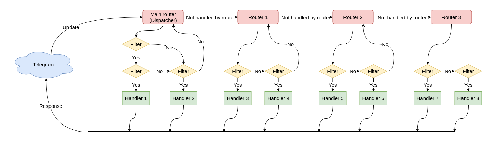

# Router
Imports:

- Recommended: `#!python3 from aiogram import Router`
- Real location: `#!python3 from aiogram.dispatcher.dispatcher import Router`


## Initializer specification
| Argument | Type | Description |
| - | - | - |
| `use_builtin_filters` | `#!python3 bool` | Register builtin filters in filters factory. Has no effect when filters is already registered in parent router. (default: `#!python3 True`) | 

Example:
```python3
router = Router()
```

Router can route update and it nested update types like messages, callback query, polls and all other event types.

## Event observers
Here is used event-observer pattern. (Read more on [observer page >>](observer.md))

Event handlers can be registered in observer by two ways:

1. By observer method - `#!python3 router.<event_type>.register(handler, <filters, ...>)`
1. By decorator - `#!python3 @router.<event_type>(<filters, ...>)`

!!! warning
    
    All handlers is always should be an asynchronous.
    Name of handler function is not important. Event argument name is also is not important but is recommended to don't overlap the name with contextual data in due to function can not accept two arguments with the same name.  

Here is list of available observers and examples how to register handlers (In examples used only @decorator-style):

### Update
```python3
@router.update_handler()
async def message_handler(update: types.Update) -> Any: pass
```
Should be used for handling [updates](../api/types/update.md). By default Router is already have an update handler which route all event types to another observers.

### Message
```python3
@router.message_handler()
async def message_handler(message: types.Message) -> Any: pass
```
Is useful for handling [message](../api/types/message.md)

### Edited message
```python3
@router.edited_message_handler()
async def edited_message_handler(edited_message: types.Message) -> Any: pass
```
Is useful for handling [edited messages](../api/types/message.md)

### Channel post
```python3
@router.channel_post_handler()
async def channel_post_handler(channel_post: types.Message) -> Any: pass
```
Is useful for handling [channel posts](../api/types/message.md)

### Edited channel post
```python3
@router.edited_channel_post_handler()
async def edited_channel_post_handler(edited_channel_post: types.Message) -> Any: pass
```
Is useful for handling [edited channel posts](../api/types/message.md)

### Inline query
```python3
@router.inline_query_handler()
async def inline_query_handler(inline_query: types.Message) -> Any: pass
```
Is useful for handling [inline query](../api/types/inline_query.md)

### Chosen inline query
```python3
@router.chosen_inline_result_handler()
async def chosen_inline_result_handler(chosen_inline_result: types.ChosenInlineResult) -> Any: pass
```
Is useful for handling [chosen inline query](../api/types/chosen_inline_result.md)

### Callback query
```python3
@router.callback_query_handler()
async def callback_query_handler(callback_query: types.CallbackQuery) -> Any: pass
```
Is useful for handling [callback query's](../api/types/callback_query.md)

### Shipping query
```python3
@router.shipping_query_handler()
async def shipping_query_handler(shipping_query: types.ShippingQuery) -> Any: pass
```
Is useful for handling [shipping query](../api/types/shipping_query.md)

### Pre checkout query
```python3
@router.pre_checkout_query_handler()
async def pre_checkout_query_handler(pre_checkout_query: types.PreCheckoutQuery) -> Any: pass
```
Is useful for handling [pre-checkout query](../api/types/pre_checkout_query.md)

### Poll
```python3
@router.poll_handler()
async def poll_handler(poll: types.Poll) -> Any: pass
```
Is useful for handling [polls](../api/types/poll.md)


## Nested routers

!!! warning
    Routers by the way can be nested to an another routers with some limitations:
    
    1. Router **CAN NOT** include itself
    1. Routers **CAN NOT** be used for circular including (router 1 include router 2, router 2 include router 3, router 3 include router 1)


Example:
```python3
# module_1.py
router1 = Router()
router2 = Router()

router2.include_router(router1)
```


## How it works?

For example dispatcher has 2 routers, last one router is also have one nested router:

[](../assets/images/nested_routers_example.png)
_(Click on image to zoom it)_

In this case update propagation flow will have form:

[](../assets/images/update_propagation_flow.png)
_(Click on image to zoom it)_

