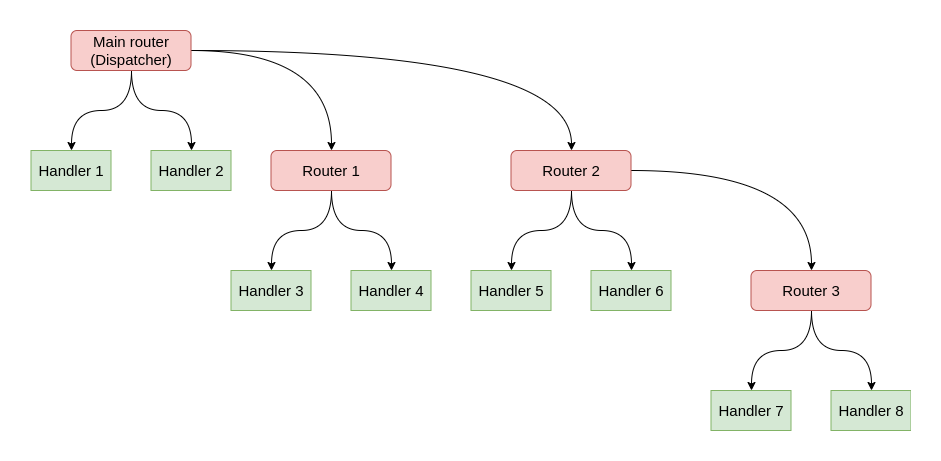

.. _Router:

######
Router
######

Usage:

.. code-block:: python

    from aiogram import Router
    from aiogram.types import Message

    my_router = Router(name=__name__)

    @my_router.message()
    async def message_handler(message: Message) -> Any:
        await message.answer('Hello from my router!')

.. autoclass:: aiogram.dispatcher.router.Router
    :members: __init__, include_router, include_routers, resolve_used_update_types
    :show-inheritance:

.. _Event observers:

Event observers
===============

.. warning::

    All handlers always should be asynchronous.
    The name of the handler function is not important. The event argument name is also not important but it is recommended to not overlap the name with contextual data in due to function can not accept two arguments with the same name.

Here is the list of available observers and examples of how to register handlers

In these examples only decorator-style registering handlers are used, but if you don't like @decorators just use :obj:`<event type>.register(...)` method instead.

Message
-------

.. attention::

    Be attentive with filtering this event

    You should expect that this event can be with different sets of attributes in different cases

    (For example text, sticker and document are always of different content types of message)

    Recommended way to check field availability before usage, for example via :ref:`magic filter <magic-filters>`:
    :code:`F.text` to handle text, :code:`F.sticker` to handle stickers only and etc.

.. code-block:: python

    @router.message()
    async def message_handler(message: types.Message) -> Any: pass

Edited message
--------------

.. code-block:: python

    @router.edited_message()
    async def edited_message_handler(edited_message: types.Message) -> Any: pass

Channel post
------------

.. code-block:: python

    @router.channel_post()
    async def channel_post_handler(channel_post: types.Message) -> Any: pass

Edited channel post
-------------------

.. code-block:: python

    @router.edited_channel_post()
    async def edited_channel_post_handler(edited_channel_post: types.Message) -> Any: pass

Inline query
------------

.. code-block:: python

    @router.inline_query()
    async def inline_query_handler(inline_query: types.InlineQuery) -> Any: pass

Chosen inline query
-------------------

.. code-block:: python

    @router.chosen_inline_result()
    async def chosen_inline_result_handler(chosen_inline_result: types.ChosenInlineResult) -> Any: pass

Callback query
--------------

.. code-block:: python

    @router.callback_query()
    async def callback_query_handler(callback_query: types.CallbackQuery) -> Any: pass

Shipping query
--------------

.. code-block:: python

    @router.shipping_query()
    async def shipping_query_handler(shipping_query: types.ShippingQuery) -> Any: pass

Pre checkout query
------------------

.. code-block:: python

    @router.pre_checkout_query()
    async def pre_checkout_query_handler(pre_checkout_query: types.PreCheckoutQuery) -> Any: pass

Poll
----

.. code-block:: python

    @router.poll()
    async def poll_handler(poll: types.Poll) -> Any: pass

Poll answer
-----------

.. code-block:: python

    @router.poll_answer()
    async def poll_answer_handler(poll_answer: types.PollAnswer) -> Any: pass

My chat member
--------------

.. code-block:: python

    @router.my_chat_member()
    async def my_chat_member_handler(my_chat_member: types.ChatMemberUpdated) -> Any: pass

Chat member
-----------

.. code-block:: python

    @router.chat_member()
    async def chat_member_handler(chat_member: types.ChatMemberUpdated) -> Any: pass

Chat join request
-----------------

.. code-block:: python

    @router.chat_join_request()
    async def chat_join_request_handler(chat_join_request: types.ChatJoinRequest) -> Any: pass

Message reaction
----------------

.. code-block:: python

    @router.message_reaction()
    async def message_reaction_handler(message_reaction: types.MessageReactionUpdated) -> Any: pass

Message reaction count
----------------------

.. code-block:: python

    @router.message_reaction_count()
    async def message_reaction_count_handler(message_reaction_count: types.MessageReactionCountUpdated) -> Any: pass

Chat boost
----------

.. code-block:: python

    @router.chat_boost()
    async def chat_boost_handler(chat_boost: types.ChatBoostUpdated) -> Any: pass

Remove chat boost
-----------------

.. code-block:: python

    @router.removed_chat_boost()
    async def removed_chat_boost_handler(removed_chat_boost: types.ChatBoostRemoved) -> Any: pass

Errors
------

.. code-block:: python

    @router.errors()
    async def error_handler(exception: types.ErrorEvent) -> Any: pass

Is useful for handling errors from other handlers, error event described :ref:`here <error-event>`

.. _Nested routers:

Nested routers
==============

.. warning::

    Routers by the way can be nested to an another routers with some limitations:
        1. Router **CAN NOT** include itself
        1. Routers **CAN NOT** be used for circular including (router 1 include router 2, router 2 include router 3, router 3 include router 1)

Example:

.. code-block:: python
    :caption: module_1.py
    # module_1

    router2 = Router()

    @router2.message()
    ...

.. code-block:: python
    :caption: module_2.py
    # module_2

    from module_2 import router2

    router1 = Router()
    router1.include_router(router2)

Update
------

.. code-block:: python

    @dispatcher.update()
    async def message_handler(update: types.Update) -> Any: pass

.. warning::

    The only root Router (Dispatcher) can handle this type of event.

.. note::

    Dispatcher already has default handler for this event type, so you can use it for handling all updates that are not handled by any other handlers.

How it works?
-------------

For example, dispatcher has 2 routers, the last router also has one nested router:

In this case update propagation flow will have form:

.. image:: ../_static/update_propagation_flow.png
    :alt: Nested routers example
